⚠️ Disclaimer: The gifs are not always up-to-date and may show older map versions

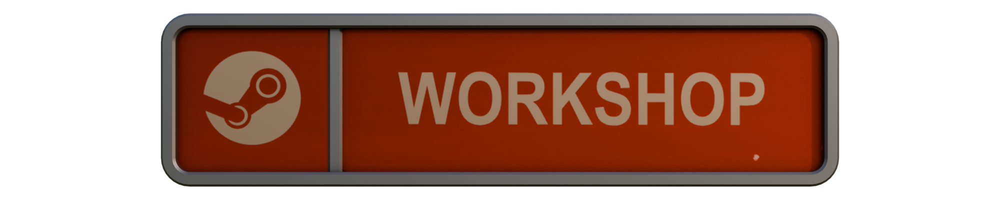

Checkout the map on the [Steam Workshop](https://steamcommunity.com/sharedfiles/filedetails/?id=3532548365).

The layout of the map can be changed using the `InitWaveOutput` in the .pop files. The table shows the different relays and their actions.

| Relay                          | Description                                                |
| ------------------------------ | ---------------------------------------------------------- |
| relay_advance_sequence_n       | Advances the sequence by n steps                           |
| relay_advance_sequence_n_abort | Advances the sequence by n steps and aborts it right after |
| relay_abort_sequence           | Aborts the sequence without advancing                      |
| relay_idle_sequence            | Does not alter the sequence.                               |

⚠️ If any `relay_advance_` or `relay_abort_` is used, **all** waves must define a `InitWaveOutput` action. If the sequence should not change use `relay_idle_sequence`. This is required to properly reset the sequence.

As they use the `InitWaveOutput` Trigger, the actions are always executed before the wave. Defining `relay_advance_sequence_1` in the first wave will result in the first step being executed immediately after the map loads. Advancing the sequence triggers the steps one after another. The sequence consists of the following 5 steps.

The first step does not alter the layout of the map. The sequence sign is set to `In progress`

The first outlet of the upper dam is closed. This results in one of the water streams draining. This does not alter the layout massively, but allows players to use the third spawn exit without taking damage. The sign `Outlet 1` is set to active.

The second outlet of the upper dam is closed. The entire water channel is drained. Bots may chose the channel as a secondary path jumping down from the bridge. The channel path has a higher chance to be chosen compared to the regular path, as it is shorter and more claustrophobic and thus harder to defend. The sign `Outlet 2` is set to active.

All water is drained from the lake. The death pit remains, but bots are no longer sucked into the death pit. Bots and tanks can chose the channel path. Like before, the channel path has a higher chance to be chosen compared to the regular path. The sign `Drain` is set to active.

The outlet of the lower dam is closed. This removed the death pit completely. The sign `Outlet 3` is set to active.

Aborting the sequence stops further steps from executing, effectively locking the current state for the remainder of the game. Additionally a new bot spawn point is enabled, making the starter area harder to defend.

Gatebots can capture a control point near the lift. Once captured, the lift is lowered enabling a shortcut route for bots and tanks. After a tank uses the lift, the shortcut is closed and the control point is reset.

If the shortcut is enabled, bots and tanks are going to prioritize the shortcut path. If the shortcut is disabled during a wave, the remaining bots will fallback to the path marked with white projectors.

| File               | Description                                                          |
| ------------------ | -------------------------------------------------------------------- |
| gate               | Contains gatebots that enable the shortcut & tanks that use/close it |
| gate_flank         | Same as `gate` but uses the flank spawns                             |
| sequence           | Advances the sequence every wave starting after the first wave       |
| sequence_abort     | Advances the sequence and aborts it after step #3                    |
| sequence_completed | Starts the map with the entire sequence already completed            |

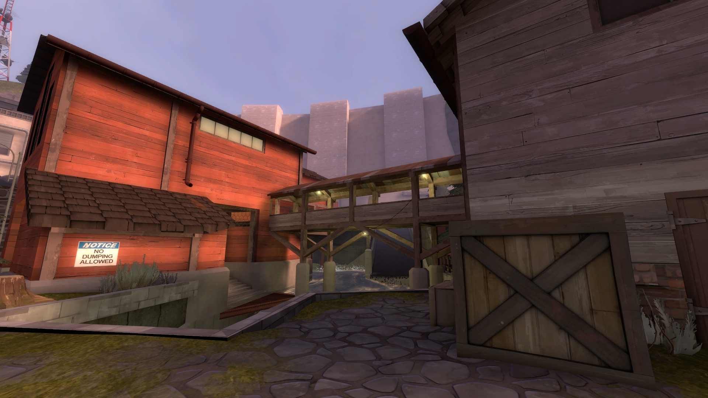
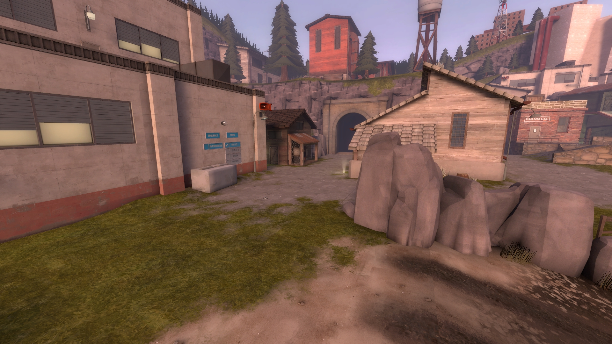
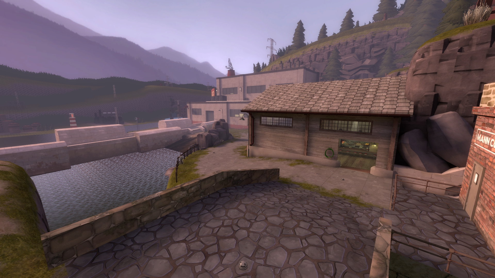

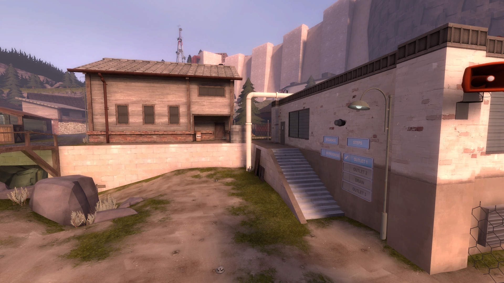
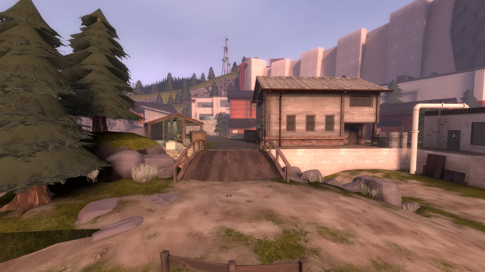
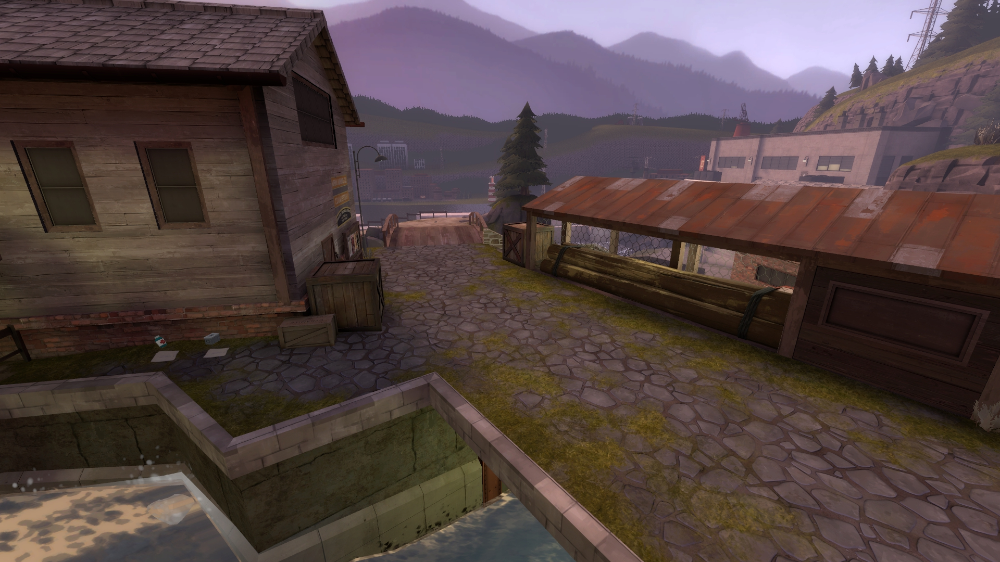

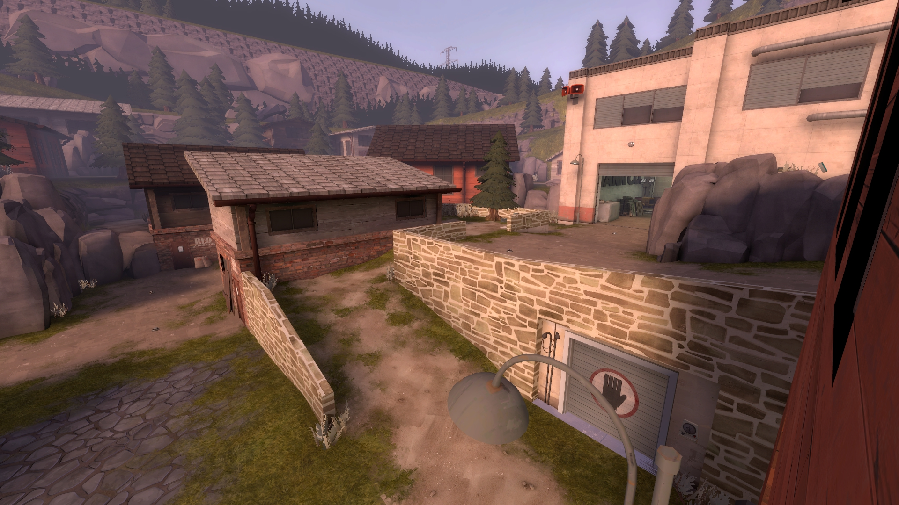
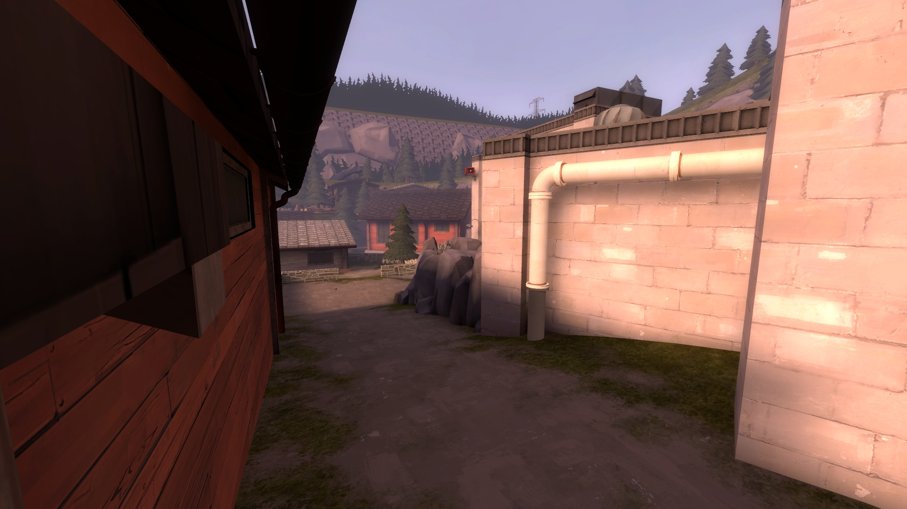

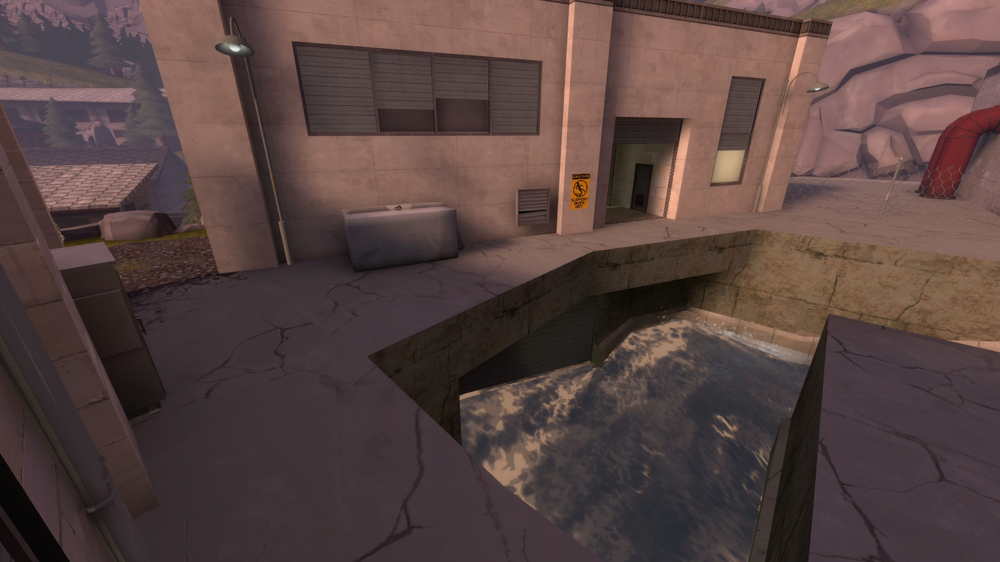
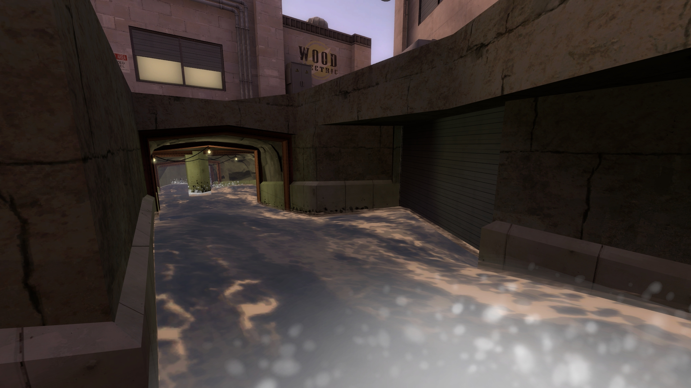
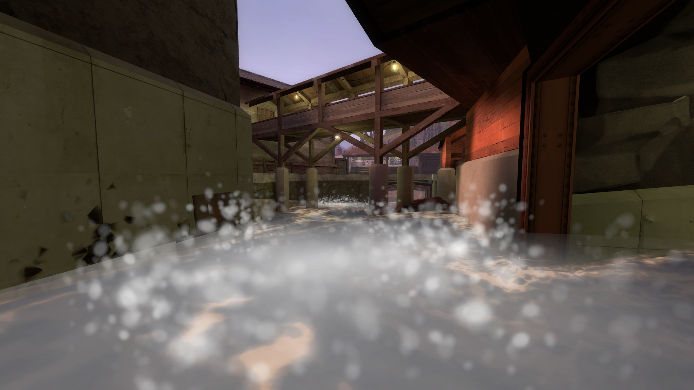
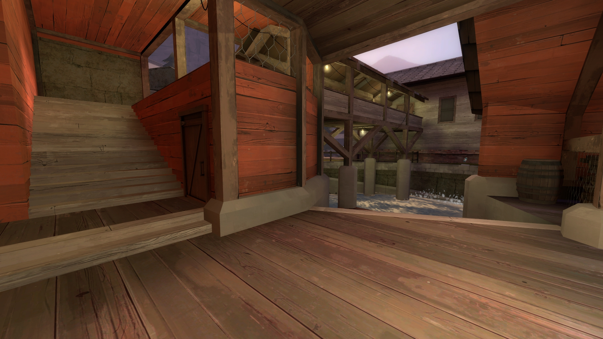
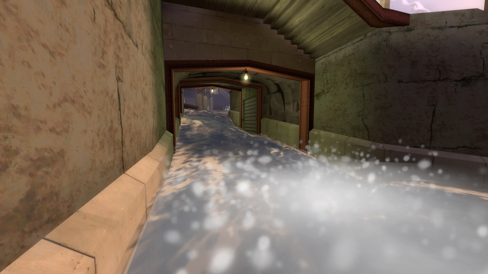
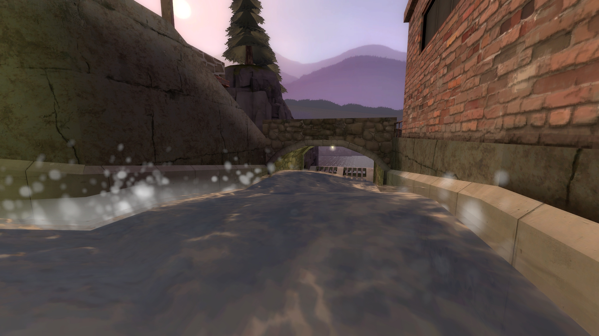
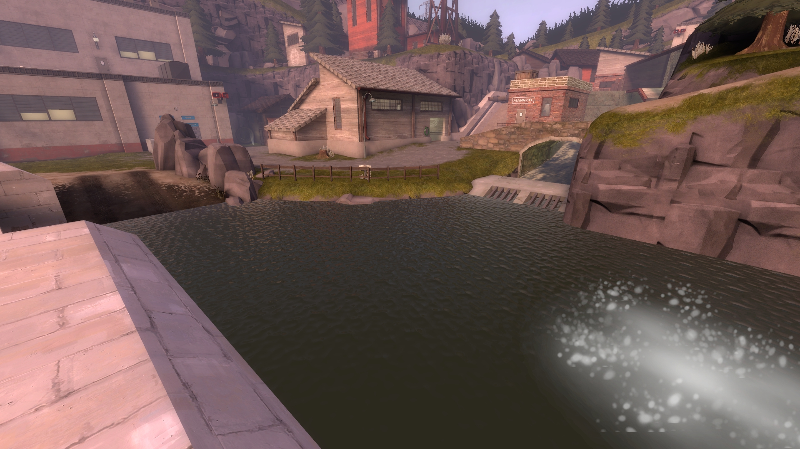

